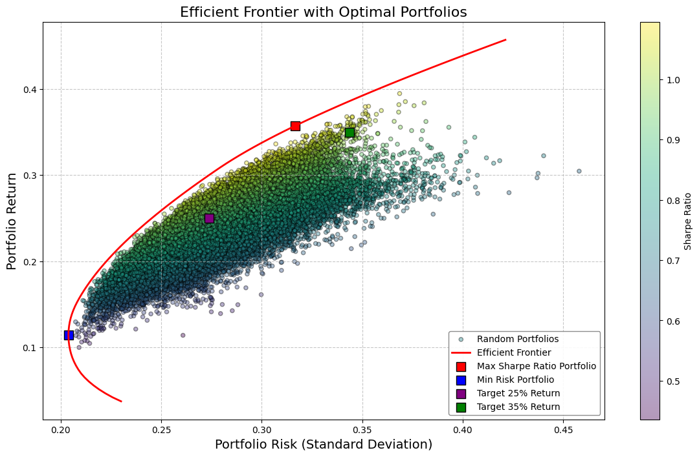

# Portfolio Optimization Project

This project demonstrates portfolio optimization using stock data from 11 major American companies. We retrieve historical stock prices from Yahoo Finance and calculate optimal portfolios along the efficient frontier. The analysis focuses on constructing portfolios with the maximum Sharpe ratio, minimum risk, and specific target returns.

## Project Overview

The goal of this analysis is to construct an optimal portfolio that aligns with specific investment objectives, such as maximizing the Sharpe ratio, minimizing risk, or achieving a target return. We use techniques from modern portfolio theory to determine the efficient frontier and identify the most efficient asset allocation.

## Jupyter Notebook

You can view all the code and detailed analysis in the Jupyter Notebook:

- [Portfolio Optimization Notebook](Modern_Portfolio_Theory.ipynb) - This file contains the full analysis, from data preprocessing to plotting the efficient frontier.

## Key Objectives

- Calculate daily and logarithmic returns for selected assets.
- Compute the covariance and correlation matrices.
- Generate and visualize random portfolios.
- Plot the efficient frontier.
- Identify optimal portfolios based on:
  - Maximum Sharpe Ratio
  - Minimum Risk
  - Custom Target Returns (e.g., 25% and 35%)

## Dataset

The data is retrieved live from Yahoo Finance using the `yfinance` library. We selected 11 prominent companies from the American stock exchange:
- Apple Inc. (`AAPL`)
- Microsoft Corp. (`MSFT`)
- Amazon.com Inc. (`AMZN`)
- Alphabet Inc. (`GOOGL`)
- Meta Platforms, Inc. (`META`)
- Tesla Inc. (`TSLA`)
- NVIDIA Corporation (`NVDA`)
- Netflix Inc. (`NFLX`)
- Intel Corporation (`INTC`)
- Advanced Micro Devices, Inc. (`AMD`)
- International Business Machines Corporation (`IBM`)

## Data Retrieval

We use the `yfinance` library to pull the historical adjusted closing prices for each stock from January 1, 2014, to January 1, 2024.

## Analysis Steps

1. **Data Preparation**
   - Load data and calculate daily price changes.
   - Compute daily and logarithmic returns.

2. **Statistical Analysis**
   - Generate covariance and correlation matrices for returns.
   - Visualize correlations using a heatmap.

3. **Portfolio Simulation**
   - Generate random portfolios to explore the risk-return spectrum.
   - Compute portfolios that maximize the Sharpe ratio and minimize portfolio risk.
   - Plot the efficient frontier and highlight optimal portfolios for specific target returns.

4. **Efficient Frontier**
   The efficient frontier shows the set of portfolios offering the highest expected return for a given level of risk. Key points on this curve include:
   - **Maximum Sharpe Ratio Portfolio**: The portfolio that provides the best risk-adjusted return.
   - **Minimum Risk Portfolio**: The portfolio with the lowest risk.
   - **Target Return Portfolios**: Portfolios constructed to achieve specific return targets, e.g., 25% and 35% annualized returns.

5. **Visualization**
   - Display the efficient frontier plot, showcasing the different portfolio strategies.

## Results

The analysis produces a comprehensive visualization of the efficient frontier with marked points for:
- **Max Sharpe Ratio Portfolio** (Highest risk-adjusted return)
- **Min Risk Portfolio** (Lowest possible risk)
- **Target Return Portfolios** (Portfolios meeting specific return goals)

The following plot illustrates the efficient frontier and optimal portfolio allocations:

## Getting Started

### Prerequisites

- Python (version 3.8+ recommended)
- Required libraries:
  - `numpy`
  - `pandas`
  - `matplotlib`
  - `seaborn`
  - `yfinance`

## Conclusion

This project provides insights into optimal portfolio allocation, balancing returns and risk. The efficient frontier and calculated optimal portfolios serve as a guide for constructing diversified portfolios tailored to specific investment strategies.

